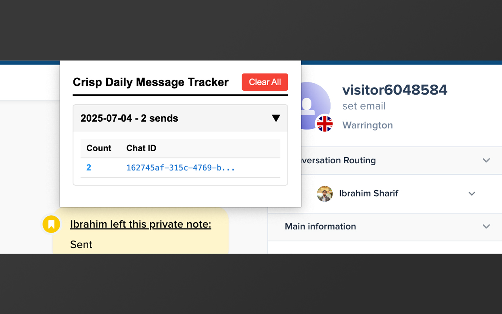
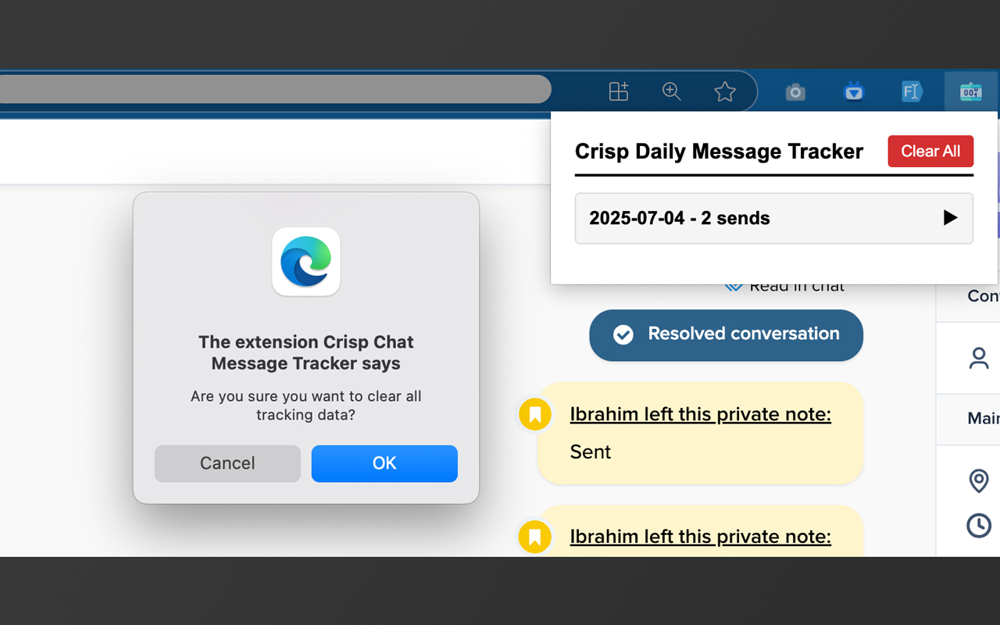

# Crisp Chat Message Tracker

A Chrome extension that tracks and displays your daily message activity on Crisp Chat platform with detailed analytics and message history.

## Features

### 📊 Daily Message Tracking
- Automatically tracks every message you send in Crisp Chat
- Organizes data by date for easy daily analysis
- Shows total message count per day

### 💬 Chat-Specific Analytics
- Groups messages by individual chat sessions
- Displays message count per chat conversation
- Shows chat IDs with direct links to conversations

### 📝 Detailed Message History
- Stores message content and timestamps
- Detects and marks messages with media attachments (📎)
- Expandable accordion view for easy browsing

### 🔍 Smart Data Organization
- Collapsible date sections for better navigation
- Chat sessions sorted by message count (most active first)
- Truncated message previews with full content on hover

### 🗑️ Data Management
- One-click clear all data functionality
- Confirmation dialog to prevent accidental data loss
- Data stored locally in your browser

## How It Works

The extension operates through three main components:

### 1. Content Script Monitoring
- Runs automatically when you visit `https://app.crisp.chat/*`
- Monitors the DOM for message sending activities
- Captures message content, timestamps, and media attachments
- Stores data in browser's local storage

### 2. Real-time Data Collection
- Detects when you send messages in Crisp Chat
- Extracts message text and metadata
- Identifies media attachments (images, files, etc.)
- Groups messages by chat session and date

### 3. Analytics Dashboard
- Accessible via extension popup (click extension icon)
- Displays organized data in an intuitive accordion interface
- Provides daily summaries and detailed breakdowns
- Offers direct links back to specific chat conversations

## Installation

### From Chrome Web Store (Recommended)
1. Visit the [Chrome Web Store page](#) (link will be available after publishing)
2. Click "Add to Chrome"
3. Confirm the installation when prompted

### Manual Installation (Development)
1. Download or clone this repository
2. Open Chrome and navigate to `chrome://extensions/`
3. Enable "Developer mode" in the top right
4. Click "Load unpacked" and select the extension folder
5. The extension will appear in your Chrome toolbar

## Getting Started

1. **Install the Extension**: Follow the installation steps above

2. **Open Crisp Chat**: Navigate to `https://app.crisp.chat/` and log in to your account

3. **Start Messaging**: Send messages normally in your Crisp Chat conversations

4. **View Analytics**: 
   - Click the extension icon in your Chrome toolbar
   - Browse your daily message statistics
   - Expand date sections to see chat-specific details
   - Click on chat IDs to return to specific conversations

5. **Manage Data**:
   - Use the "Clear All" button to reset tracking data
   - Data is stored locally and private to your browser

## Usage Tips

- **Daily Tracking**: Check your daily message counts to monitor productivity
- **Chat Analysis**: Identify your most active conversations
- **Message Review**: Use the detailed view to review recent message content
- **Quick Navigation**: Click chat IDs to quickly return to specific conversations
- **Data Management**: Regularly clear old data if needed to maintain performance

## Privacy & Security

- **Local Storage Only**: All data is stored locally in your browser
- **No External Servers**: No data is sent to external servers or third parties
- **Crisp Chat Only**: Extension only activates on Crisp Chat domains
- **User Control**: Complete control over data with clear all functionality

## Technical Details

- **Manifest Version**: 3 (latest Chrome extension standard)
- **Permissions**: Minimal required permissions for functionality
- **Storage**: Browser's localStorage API
- **Compatibility**: Chrome 88+ and other Chromium-based browsers

## Permissions Explained

- **storage**: Store tracking data locally in your browser
- **activeTab**: Access the current Crisp Chat tab for data collection
- **scripting**: Execute content scripts to monitor message activity

## Support

If you encounter any issues or have suggestions:

1. Check that you're on a supported Crisp Chat page (`https://app.crisp.chat/*`)
2. Ensure the extension has proper permissions
3. Try refreshing the Crisp Chat page
4. For persistent issues, please [create an issue]([#](https://github.com/shuvoaftab/chrome-extensions/issues)) in our repository

## Contributing

We welcome contributions! Please feel free to submit pull requests or create issues for bugs and feature requests.

## License

This project is licensed under the MIT License - see the [LICENSE](LICENSE) file for details.

## Changelog

### Version 1.0
- Initial release
- Daily message tracking
- Chat-specific analytics
- Detailed message history
- Data management features

## Publisher
- Developer: Ibrahim Sharif
- Website: https://ibrahimsharif.com
- Blog: https://ibrahimsharif.com/posts

---

**Note**: This extension is not affiliated with or endorsed by Crisp Chat. It's an independent tool designed to help users track their messaging activity.
